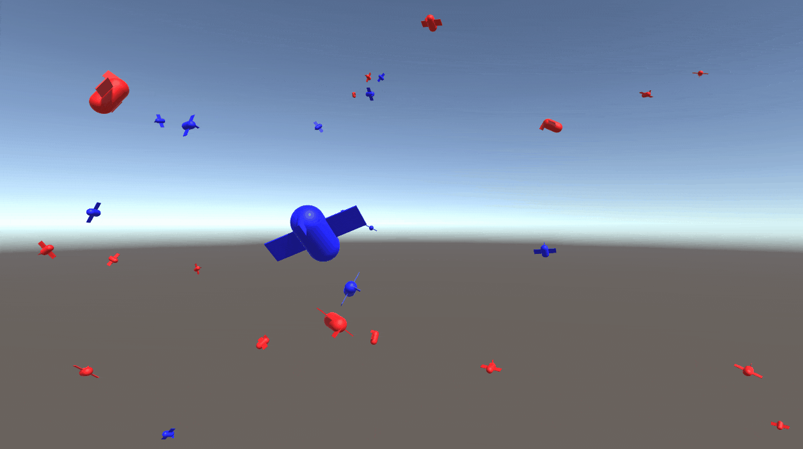

Torque Test
===

## Description
Implementation of test for control torque program.

This is an implementation of the content of [this lecture](https://www.youtube.com/watch?v=FqjM9oujyNE&t=0s).

## References
[[Unity道場 札幌スペシャル]プロが教える脱初心者スクリプト術！](https://www.youtube.com/watch?v=FqjM9oujyNE&t=0s)  
